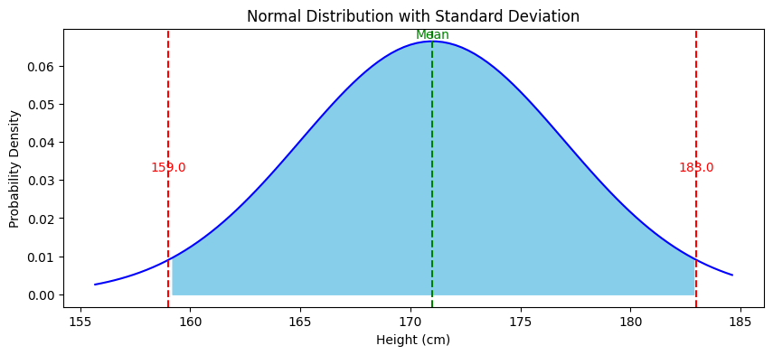

# La Omnipresente Distribución Normal

## La Distribución Normal en Análisis de Datos

La Distribución Normal se erige como una figura central en el ámbito de la estadística, distinguida por su forma de campana. Su elegancia teórica se complementa con su utilidad práctica, facilitando la comprensión de los patrones que subyacen a una amplia variedad de fenómenos naturales y sociales. Esta distribución no solo sirve para modelar la realidad con una precisión notable, sino que también establece un puente entre la teoría estadística y su implementación en el análisis de datos, incluyendo aquellos generados por sistemas de inteligencia artificial y aprendizaje automático.

## Aplicabilidad

Por ejemplo, al examinar la altura de los adultos, la distribución normal nos ayuda a entender que, aunque las alturas varían, es más probable encontrar a una persona de estatura promedio que una significativamente más baja o más alta. Esta distribución puede ser utilizada en campos como la medicina, por ejemplo, para determinar rangos de altura normales y, por extensión, identificar desviaciones que podrían indicar condiciones de salud subyacentes. Además, en el diseño de productos como la ropa y los muebles, comprender la distribución de la altura puede ser crucial para satisfacer las necesidades ergonómicas de la población.

```python
import pandas as pd
import numpy as np

np.random.seed(0)

# https://repository.usta.edu.co/bitstream/handle/11634/14486/2018sergioboh%C3%B3rquez4.pdf
n = 100
id = range(1, n + 1)
mean = 171
std_dev = 6.0
height = np.random.normal(mean, std_dev, n)

data = pd.DataFrame({'ID': id, 'Height': height})
data.sort_values(by=['Height'],inplace=True,ignore_index=True)
```

```python
import matplotlib.pyplot as plt
import seaborn as sns

plt.figure(figsize=(10, 4))
x_values = np.linspace(data['Height'].min(), data['Height'].max(), 100)
y_values = (1 / (std_dev * np.sqrt(2 * np.pi))) * np.exp( - (x_values - mean)**2 / (2 * std_dev**2))

plt.plot(x_values, y_values, color='red', lw=2)
plt.title('Normal Distribution of Colombian Heights')
plt.xlabel('Height (cm)')
plt.ylabel('Probability Density')
plt.show()
```
 


La normalidad de la distribución de la altura implica que la mayoría de las personas se agrupan alrededor de una estatura media, con alturas que se desvían ligeramente de esta media siendo comunes, y alturas que se desvían en gran medida siendo raras. Esta característica se visualiza claramente en el gráfico proporcionado, donde la densidad de probabilidad alcanza su punto máximo en el promedio y disminuye hacia los extremos.

## Variabilidad

La desviación estándar, un componente crítico en la representación de la distribución normal, es lo que nos permite entender la dispersión de un conjunto de datos alrededor de la media. Es más, bajo la regla 68-95-99,7, sabemos que aproximadamente el 68% de las mediciones se sitúan a una desviación estándar de la media, mientras que alrededor del 95% caen dentro de las dos desviaciones estándar, y cerca del 99,7% están comprendidas dentro de las tres. En la distribución normal de la altura de los adultos, con una desviación estándar de 6 centímetros, la mayoría de las mediciones, específicamente el 95%, se ubican dentro de un rango de 159 cm a 183 cm, lo que representa más o menos dos desviaciones estándar del promedio situado en 171 cm.

```python
# Calculate the range within two standard deviations
lower_bound = mean - 2 * std_dev
upper_bound = mean + 2 * std_dev

plt.figure(figsize=(10, 4))

plt.plot(x_values, y_values, color='blue')
plt.fill_between(x_values, y_values, where=(lower_bound < x_values) & (x_values < upper_bound), color='skyblue')
plt.axvline(mean, color='green', linestyle='--')

plt.axvline(lower_bound, color='red', linestyle='--')
plt.axvline(upper_bound, color='red', linestyle='--')

plt.text(mean, max(y_values), 'Mean', ha='center', va='bottom', color='green')
plt.text(lower_bound, max(y_values)/2, f'{lower_bound:.1f}', ha='center', va='center', color='red')
plt.text(upper_bound, max(y_values)/2, f'{upper_bound:.1f}', ha='center', va='center', color='red')

plt.title('Normal Distribution with Standard Deviation')
plt.xlabel('Height (cm)')
plt.ylabel('Probability Density')
plt.show()

```
    


El conocimiento del promedio y de la desviación estándar es crucial para construir la distribución normal. El promedio sitúa el centro de la curva, y la desviación estándar determina qué tan ancha será esta curva. Una curva más ancha señala una mayor variabilidad en las mediciones de altura, lo que significa que hay una mayor dispersión alrededor del promedio. En contraste, una curva estrecha indica que las mediciones están más agrupadas cerca del promedio, reflejando una menor variabilidad. Este principio nos permite predecir con alta probabilidad que la mayoría de las mediciones estarán cerca del valor medio, y que es menos probable observar valores extremadamente altos o bajos.

## Universalidad de la Distribución Normal

La distribución normal o gaussiana es una herramienta estadística omnipresente, trascendiendo su uso más conocido en la medición de la altura para aplicarse a una vasta gama de variables naturales y humanas, como el peso corporal, los tiempos de desplazamiento diario y más allá. Su relevancia se debe a su capacidad para sintetizar datos complejos en una forma que es tanto comprensible como matemáticamente elegante.

El corazón de su omnipresencia yace en el teorema del límite central, un pilar estadístico que establece que, bajo condiciones adecuadas, la media de un número suficiente de muestras independientes de una población se distribuirá normalmente, independientemente de la forma de la distribución de la población. Esta propiedad "mágica" convierte a la distribución normal en una herramienta de análisis poderosa y confiable, permitiendo a los estadísticos y científicos de datos hacer inferencias significativas y predicciones basadas en la muestra de datos, incluso cuando la población total es desconocida o inaccesible.

La distribución normal funciona como un lenguaje universal en el análisis de datos, proporcionando un marco para comprender la variabilidad y la probabilidad en muchos contextos diferentes. Este fenómeno estadístico es una muestra clara de cómo los patrones matemáticos pueden reflejar y explicar los patrones en nuestro mundo.

## Conclusión

La relevancia de la distribución normal en estadística trasciende su representación gráfica, demostrando ser una herramienta indispensable en la modelación de datos y la inferencia estadística. A través de su comprensión, se abren caminos para la predicción y la toma de decisiones en múltiples campos, desde la investigación científica hasta la innovación tecnológica. Así, la distribución normal se mantiene como un pilar en el análisis de datos, cuya comprensión es fundamental al explorar las tendencias y aplicaciones prácticas en ciencia de datos, inteligencia artificial y aprendizaje automático.